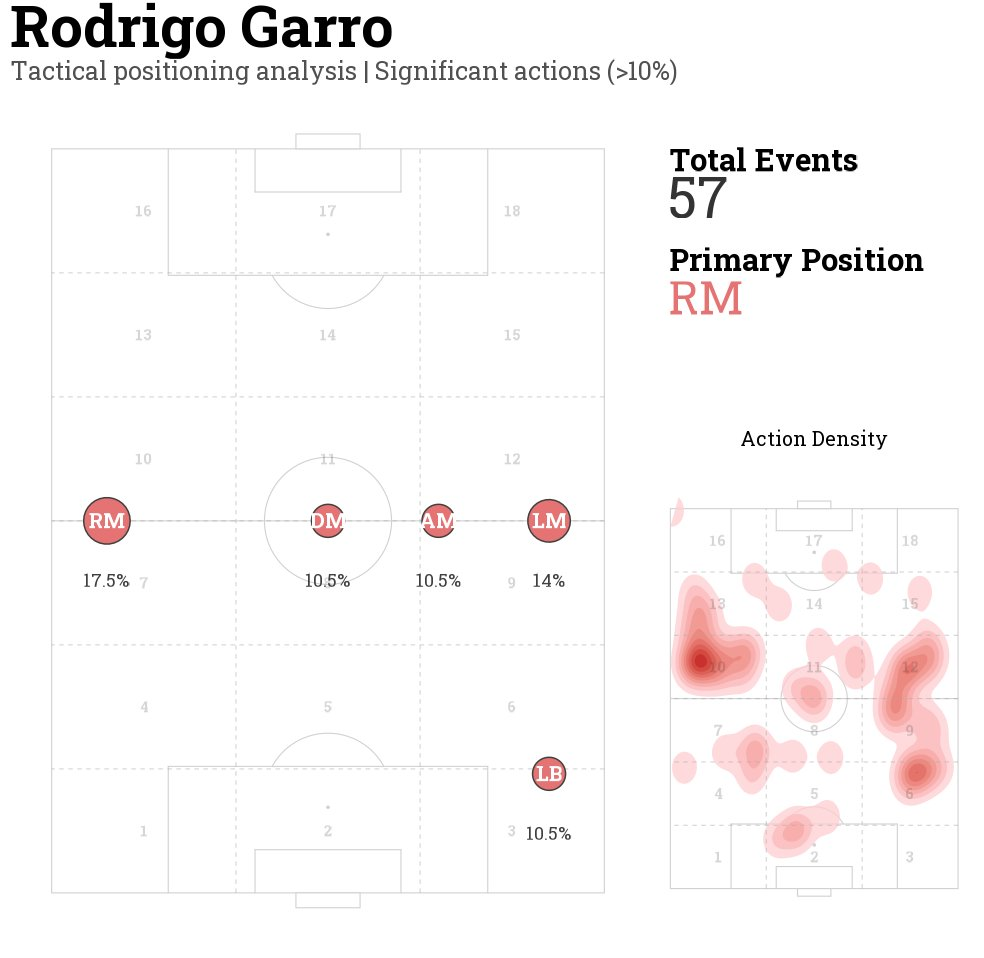

# ⚽ Análise Tática de Posicionamento - Futebol com R & ggsoccer

Este repositório contém um script em **R** desenvolvido para realizar análises avançadas de **posicionamento tático** e **densidade de ações** de jogadores de futebol, utilizando dados de eventos de partidas (ex: Opta/wyscout via arquivos CSV). 

Como o R é a linguagem padrão em nossa área de atuação analítica, todo o fluxo de engenharia de dados, processamento estatístico e visualização gráfica foi construído nativamente utilizando pacotes robustos do ecossistema R.

---

## 📊 Visão Geral do Projeto & Exemplo Visual

O script processa os dados de uma partida específica (ex: *Bahia vs. Corinthians*), filtra as ações de um atleta selecionado (como *Rodrigo Garro*), calcula a distribuição percentual das suas zonas de atuação em um grid tático universal (estilo UEFA/Opta) e gera um painel composto (*dashboard*) profissional.

### 🖼️ Exemplo do Painel Tático Gerado (`final_plot`)

Abaixo está o resultado visual gerado pelo código em R, combinando o mapa de zonas principais com um mapa de calor detalhado da densidade de ações do jogador:

<p align="center">
  
</p>

*O dashboard exibe:*
1. **Mapeamento de Zonas com Relevância (>10%):** Identifica as siglas das posições táticas predominantes (ex: `RM`, `LM`, `AM`, `DM`, `LB`) baseadas na frequência de ações nas coordenadas do campo.
2. **Painel de Indicadores (KPIs):** Resumo com o número total de eventos filtrados e a posição primária de maior incidência.
3. **Mapa de Calor de Densidade (*Action Density*):** Estimativa de densidade bidimensional (`stat_density_2d`) que evidencia as zonas de maior permanência e intensidade do atleta em campo.

---

## 🛠️ Tecnologias e Pacotes Utilizados

O script faz uso intensivo das seguintes bibliotecas do ecossistema R:

*   **`ggplot2`**: Construção e customização de gráficos baseados na gramática dos gráficos.
*   **`ggsoccer`**: Desenho de campos de futebol com dimensões oficiais (suporte a Opta e UEFA).
*   **`patchwork`**: Combinação e alinhamento elegante de múltiplos gráficos em um único layout coeso.
*   **`dplyr` / `tidyr`**: Manipulação, agregação, filtragem e transformação de dados tabulares.
*   **`showtext`**: Integração de fontes tipográficas do Google Fonts (*Roboto Slab*) com suporte a DPI de alta resolução.

---

## ⚙️ Estrutura do Código R

O script está dividido em 4 etapas principais:

1. **Configuração Inicial:** Carregamento dos dados da partida (`read_csv`), definição do diretório do arquivo de dados e configuração do motor de fontes tipográficas (`showtext`).
2. **Mapeamento e Funções Auxiliares:**
   * `mapeamento_tatico`: De-para entre as 15 zonas universais do campo e as siglas táticas correspondentes (`LW`, `SS`, `CF`, `AM`, `DM`, `LB`, `CB`, `RB`, etc.).
   * `calc_zona_universal(x, y)`: Função customizada que traduz coordenadas cartesianas contínuas em setores discretos (`Def`, `Mid`, `Atk` e divisões laterais/centrais).
   * `adicionar_grid_uefa(p)`: Adiciona a grade de referência visual sobre o campo.
3. **Processamento de Dados:** Filtro por jogador (ex: `Rodrigo Garro`), exclusão de eventos de substituição, agrupamento por zona, cálculo de percentuais relativos e cruzamento com o grid espacial.
4. **Construção e Composição do Dashboard (`patchwork`):**
   * `p1`: Gráfico de dispersão com bolas dimensionadas por porcentagem e rotuladas com as siglas táticas.
   * `p_info`: Bloco de texto estruturado com os KPIs do jogador (Total de Eventos e Posição Primária).
   * `p_heat`: Mapa de calor estilizado com gradiente de densidade em tons de vermelho.
   * `final_plot`: União de todos os componentes através de um layout customizado com o `patchwork`.

---

## 🚀 Como Executar

1. Certifique-se de ter o **R** e o **RStudio** instalados em sua máquina.
2. Instale os pacotes necessários caso ainda não os possua:
   ```R
   install.packages(c("ggplot2", "dplyr", "tidyr", "patchwork", "showtext"))
   # Para instalar o ggsoccer (via CRAN ou GitHub):
   install.packages("ggsoccer")
